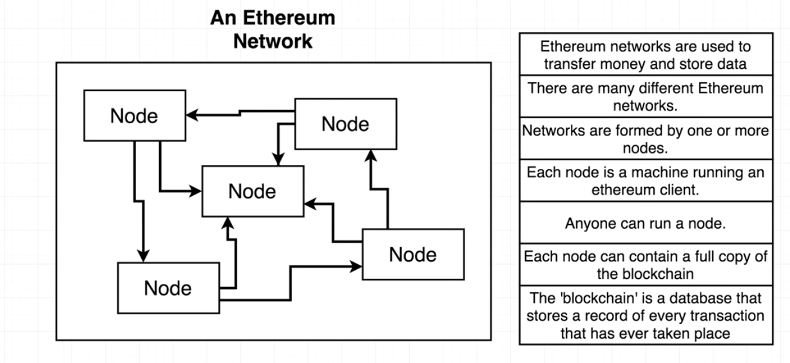
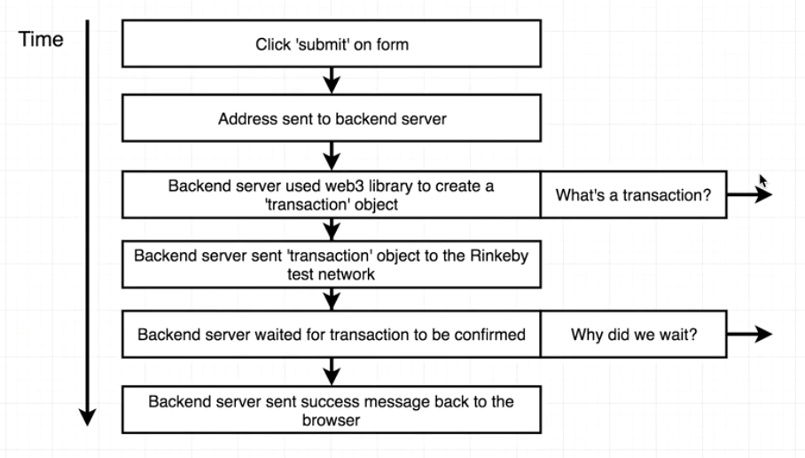
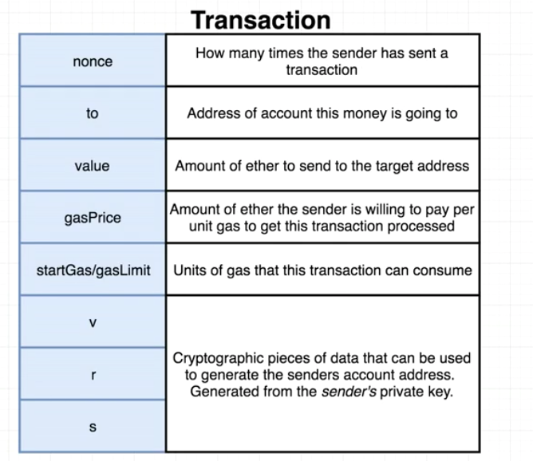

# Section 1

-   [How did it all start?](<#How did it all start?>)
-   [What is Ethereum](<#What is Ethereum?>)
-   [Smart Contact](<#Smart Contracts>)

## How did it all start?

### Bitcoin

All the hype started with Bitcoin (October 31 2008). Original white paper describing a system to allow peer to peer payments without a financial intermediary (like a bank).

Transaction reversals are cited as an issue with online commerce aka. customer to charge back a purchase.

Only purpose at the time was to enable financial transactions.

### Ethereum

Another whitepaper (2013). This guy thought about bitcoin being too simple, he is talking about ethereum to be a platforim/basis for much more advanced applications. Introduces the ide of _Smart Contract_ as an entity that can send and receive currency beyond just humans.

## What is Ethereum?

We are working with network of computers, which are used to transfer money and store data. There can be different networks

The _blockchain_ is a database that stores a record of every transaction that has ever taken place.

## Interfacing with network

There are frameworks for developers and then just normal consumer clients. Developers:`web3.js`, consumers: _Metamask (Chrome extension), Mist Browser_.

## How transactions work?

### _Transaction_

Haha nonce means nonsense :). What is odd is that the original donor is missing right? That is what _v,r,s_ is for, they are extremly complicated cryptographic properties, which are generated by the sender, that can be then reconstructed to mean who the original _sender_ is.

### Blockchain

Each block points to the one before it, it basically has a block number, nonce, the actual data and previous hash. If one block breaks, all the blocks afterwards are going to be broken. That is how blockchain is going to resist mutation.

### Mining

It is basically looking for combination of the data and the nonce to make it less than a certain number. We are looking on the value of the hash rather than specific number of digits in the number.

#### Block time

Find the final value that we are looking for e.g.: number smaller than the target value. Target block time is 15 seconds.

## Smart Contracts

It is basically an account controlled by code. It has different fields than a normal account per say. It has _balance_: Amount of ether this account owns, _storage_: Data storage for this contract and _code_: Raw machine code for this contract. Our code is compiled into the smart contract raw machine code. When the code is deployed to a network, then the contract is instantiated. But that code can be deployed to multiple networks. It behaves exactly the same as a class and a object in OOP programming.

## Solidity

-   Written in `*.sol` files
-   Strongly typed
-   Similar to javascript

Most of the work is actually not is `Solidity` but around it with HTML, CSS and so on. Contract definition is going to be put into a dedicated compyler and it is going to produce Byte code ready for deployment and Application Binary Interface (ABI).
