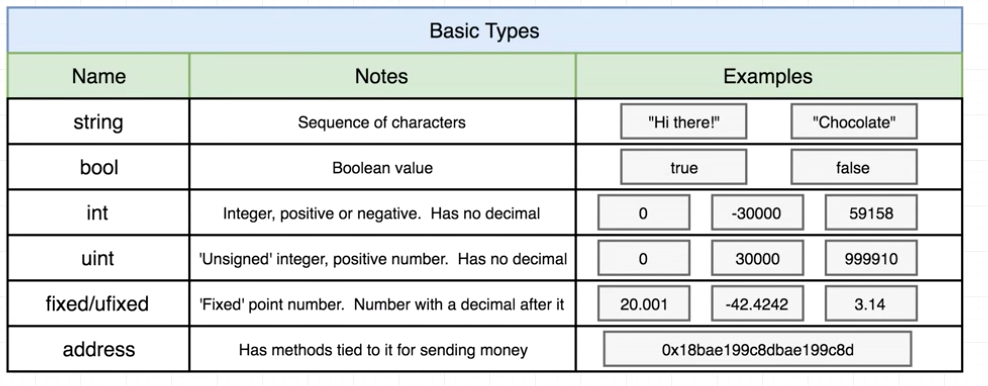
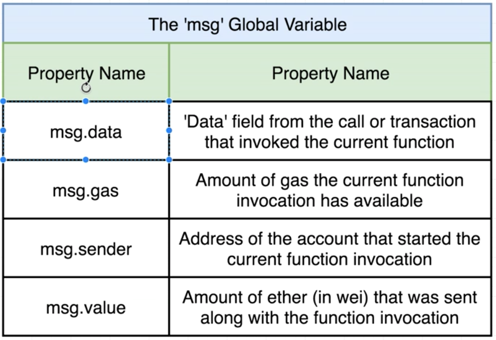
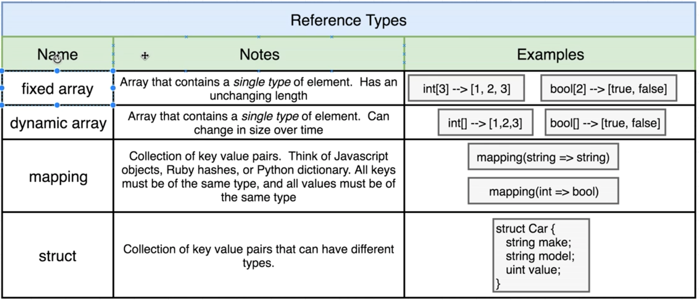

# Section 2

## Types

Basic Solidity types:



There can be also `int8` and `int<bit width>`.

## `msg` global variable



## Arrays



```solidity
contract Test{
    uint[] public myArray;
    constructor() public{
        myArray.push(1);
        myArray.push(10);
    }
    function getArray() public view returns(uint[]){
        return myArray;
    }
    gunction getArrayLength() public view returns(uint){
        return myArray.length;
    }
}
```

Solidity does not have a problem with 2D nested dynamic arrays, but, but in the javascript world it does not work. Strings are presresented as dynamic array. We cannot move array strings to the javascript world.

Solidity also does not have a random number generator. 
